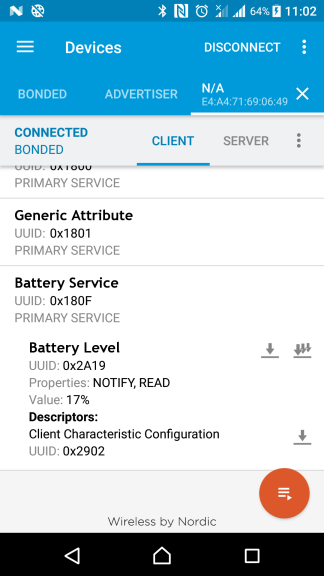

bluez-gatt-server
===================

About
-----

Create a Bluetooth Low Energy GATT Service on BlueZ from a single terminal/bash command. Update its values from a single 'mosquitto_pub' (MQTT publish) command. It just works - no extra programming required.

Easy to use
-----------

Host a BLE GATT Service with Read/Notify Characteristics from a one line bash/terminal command:

`python bluez-gatt-server.py --service_assigned_number "Battery Service" --characteristics_table_csv "example_batt_chrc.csv"`

(This can fail with `Failed to register advertisement: org.bluez.Error.Failed: Failed to register advertisement` if the connected BLE device hasn't disconnected yet)

The csv defined as:
<pre>
assigned_number,mqtt_url,default_val_hexdump
Battery Level,mqtt://localhost:1883/my_battery_level,00
</pre>

After it's running, in another terminal, we can now update/change the characteristic's value using a hex string from another (MQTT) mosquitto_pub command (this is important otherwise reads can fail as the default value is a one byte zero value that might not match your characteristic's spec) - let's try update the battery percent to 17% - this is a one-byte hex string of '11':

`mosquitto_pub -t "my_battery_level" -m "11"`

You can use the `bc` command in most GNU/Linux systems to help calculate the 1-byte hex value for us too - for example let's try update the battery percent to the same 17% value but now using bc:

`mosquitto_pub -t "my_battery_level" -m $(echo "obase=16; 17" |bc)`

(The 'default_val' of battery level specified in above csv is in the same format: so hexdump 64 means 100 so you'd get battery level 100% read if you didn't update the value via mqtt first...)

Now, use 'nRF Connect' BLE app (or similar) to read this 'battery level' characteristic from phone! Yes, it would show 17% as in below screenshot:

Then, press the 'subscribe notifications' button (three down arrows), and update the value to 16 on computer:

`mosquitto_pub -t "my_battery_level" -m "10"`

You'd see the value update to 16% in the phone app instantly!

Done - in a similar manner - you can now easily script to create and update your BLE services!

In above example, we use a one-byte length hex value to update the characteristic because it is declared as a 'uint8' in the Bluetooth specs - [see this characteristic info link](https://www.bluetooth.com/specifications/gatt/viewer?attributeXmlFile=org.bluetooth.characteristic.battery_level.xml&u=org.bluetooth.characteristic.battery_level.xml) - which is linked from [this service info link](https://www.bluetooth.com/specifications/gatt/viewer?attributeXmlFile=org.bluetooth.service.battery_service.xml) - but for other characteristics it can be multiple bytes and might have to pass through some formulas first as per the Bluetooth spec of that service's characteristic.)

Obviously, as the commands above hints, you can also specify remote MQTT servers/topics which might stream from remote sensors/notifications and you might also use various MQTT APIs to update the MQTT topic as alternatives to the 'mosquitto_pub' command too.

Easy to script, easy to use - [just like in the good old days where commands like 'hciconfig', 'sdptool' and 'rfcomm' roamed the earth](https://github.com/ykasidit/bluez-compassion). They don't make them like that any more:

This project is a fork of 'python-gatt-server' (https://github.com/Jumperr-labs/python-gatt-server.git) originally by Jumper Labs which in turn is based on 'BlueZ' (http://www.bluez.org/) example code. Credit goes to respective authors and see copyright notices of respective projects for further details.

Special thanks to the BlueZ project for providing Bluetooth support to GNU/Linux as well as their easy to program D-Bus APIs - especially from Python - much simpler than the C API in the old days.

Setup
-----

- Download, compile, install BlueZ 5.50 (./configure, make, sudo make install, sudo service bluetooth restart). Right now, we are currently using Bluez 5.50 with good success so far and no need to enable 'experimental' features. Make sure it is working (try bluetoothctl commands).
- Make sure python 'pandas' is installed. (sudo pip install pandas)
- Make sure python 'paho-mqtt' library is installed. (sudo pip install paho-mqtt)
- Make sure you've install a MQTT server (sudo apt-get install mosquitto), and a MQTT client to test (sudo apt-get install mosquitto-clients). *If you never tried this, please go through the examples at https://www.vultr.com/docs/how-to-install-mosquitto-mqtt-broker-server-on-ubuntu-16-04 - only until the 'Publish a message to topic "test"' topic is fine. (We'll use this to test updating our BLE Characteristics).*
- Make sure python 'pytest' testing library is installed. (sudo pip install pytest)
- Run 'pytest' command in this directory - make sure all tests have passed.
- Run `python bluez-gatt-server.py --help` and read through it to see how to use each option.
- For actual testing the BLE Services - we use, recommend and really want to thank Nordic semi for providing their great free Android app named 'nRF Connect'.

Updating the Bluetooth GATT Service/Characteristics Assigned Numbers
--------------------------------------------------------------------

Using a browser, you can copy the 'table' list from https://www.bluetooth.com/specifications/gatt/services and https://www.bluetooth.com/specifications/gatt/characteristics and paste into the files bt_gatt_service_assigned_numbers.csv and bt_gatt_chrc_assigned_numbers.csv respectively. Make sure you run 'pytest' again to test that the csv files are in the correct format.

Use cases
----------

- Easily host and update local BLE GATT Services from bash scripts or other software.

- Stream data frome remote notificaions to local BLE GATT Services. For example, if some low-power BLE devices that don't have internet access need to know some data/flag/command from a remote server - they can read that data/flag/command from a BLE Service/Characteristic on this GNU/Linux computer/board instead.

- Mirror/Duplicate remote BLE devices which were already setup to publish to a MQTT server - stream their BLE GATT Service/Characteristic reads/notifications to update the same on this GNU/Linux computer/board running this project. Therefore, mobile apps connect/read/display data from the remote BLE device through this computer/board.

LICENSE
-------

bluez-gatt-server 1.0 Copyright (C) 2018 Kasidit Yusuf.

Released under the GNU GPL v2 License - see COPYING file (from BlueZ project) for details. This project is a fork of 'python-gatt-server' (https://github.com/Jumperr-labs/python-gatt-server.git) originally by Jumper Labs which is based on 'BlueZ' (http://www.bluez.org/) example code. Credit goes to respective authors and see copyright notices of respective projects for further details.

